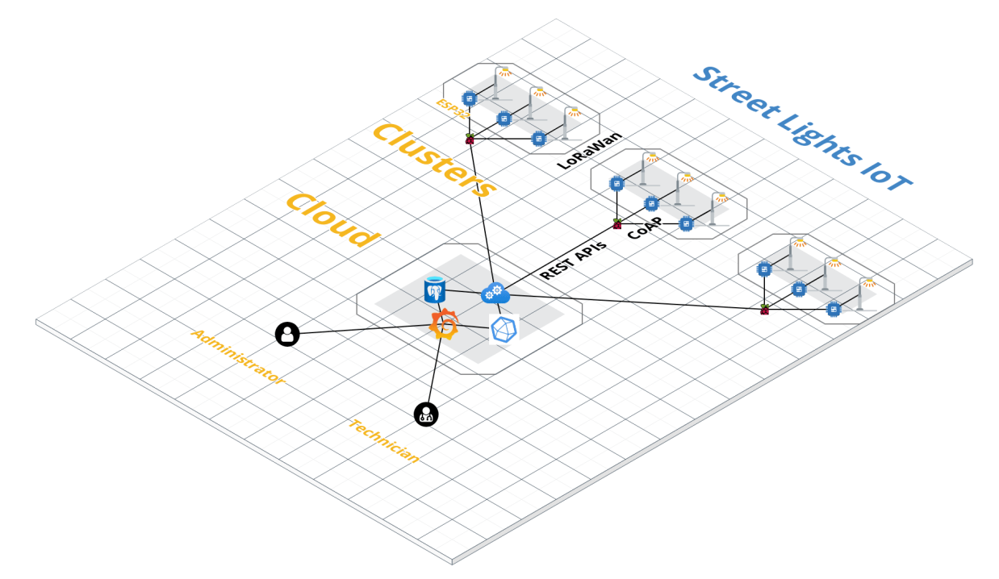

# Street Lights IOT
SmartLights IoT is a system to manage and optimize the street lighting system. More details on operation and specifications can be found in the [documentation](docs/documentation.pdf).

To provide a small overview, the 3 main modes are the following.

### Day mode

### Night mode

### Night mode eco-friendly

## Quickstart

1. Create a `.env` file with environmental variables

        POSTGRES_PASSWORD=password   
        POSTGRES_USER=street-lights-iot   
        POSTGRES_DB=resources   

        DOCKER_INFLUXDB_INIT_MODE=setup   
        DOCKER_INFLUXDB_INIT_USERNAME=street-lights-iot  
        DOCKER_INFLUXDB_INIT_PASSWORD=password  
        DOCKER_INFLUXDB_INIT_ORG=street-lights-iot  
        DOCKER_INFLUXDB_INIT_BUCKET=edge1  
        DOCKER_INFLUXDB_INIT_ADMIN_TOKEN=secret-token  

2. Start the containers

        docker-compose up

## Architecture
